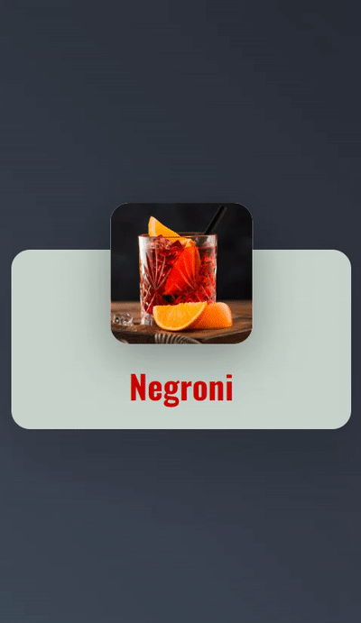

<h1>Card-cocktail</h1>

   &#160;&#160;
   &#160;&#160;
   &#160;&#160;
   &#160;&#160;

 
<h3>Descrição:</h3>

É um card com efeitos de transição que ao passar o mouse mudam de posição e tamanho.

   

<h3>Funcionalidade:</h3>

- [Acesse o projeto finalizado, online]()
